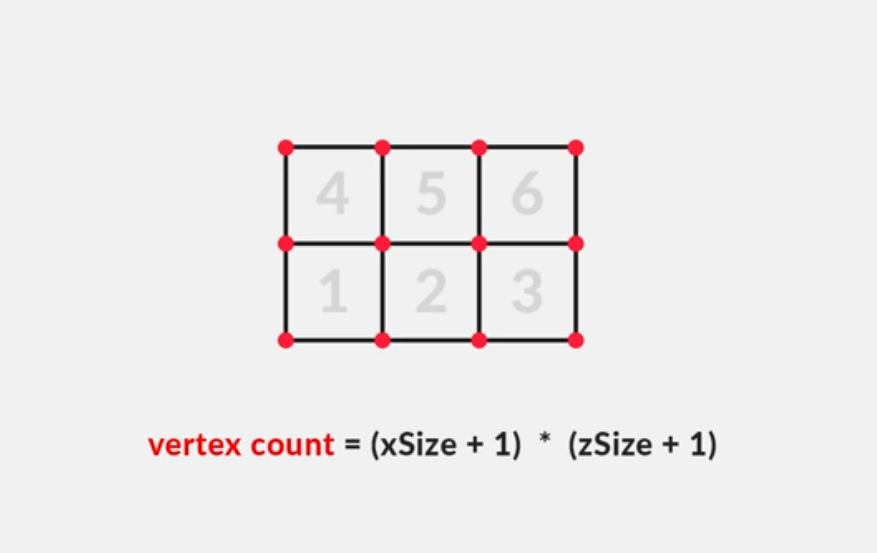
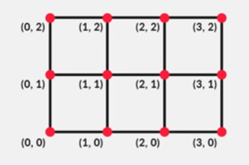

# Generating a Mesh via Script

For more detail check out
  + [Catlike Coding - Procedural Grid](https://catlikecoding.com/unity/tutorials/procedural-grid/)
  + [Brackey's video series on Procedural Mesh/terrain generation](https://www.youtube.com/watch?v=eJEpeUH1EMg)

## Intro

+ Vertices, vertex array, triangles, triangle array
  + Backface culling & triangle points sequencing
  + Shared vertices are a-ok!
+ Create an empty GameObject
+ Add Mesh Filter and a Mesh Renderer components
  + Mesh Filter holds the mesh shape itself
  + Mesh Renderer takes this data and creates what we see on screen (applying materials etc)
+ Add the MeshGen1.cs script
+ Assign a material
+ Notice the lighting works in reverse
+ Now expand the code to create a quad
+ Once your quad works, take note that you can scale and move it around like any other game object. Add a rigidbody and see it drop!

## Generating a grid

+ Build the Grid

+ Fill the Grid
  + Change void CreateShape to IEnumerator CreateShape so you can use it as a Co-Routine and employ yield return wait

## Noise

+ [What is Perlin Noise?](https://youtu.be/H6FhG9VKhJg?t=119)
