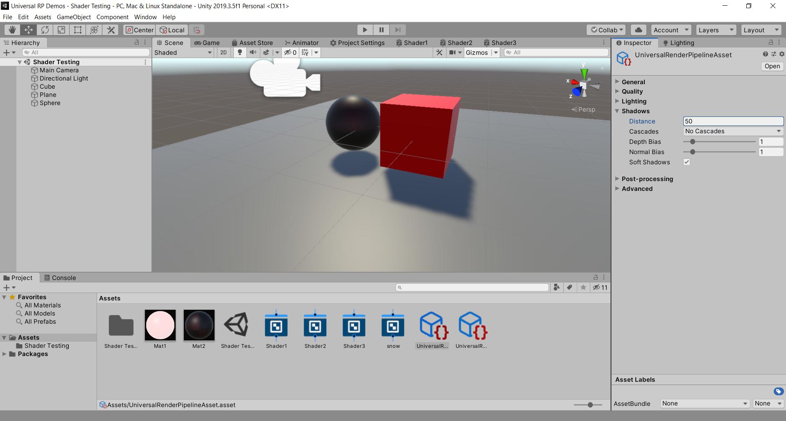
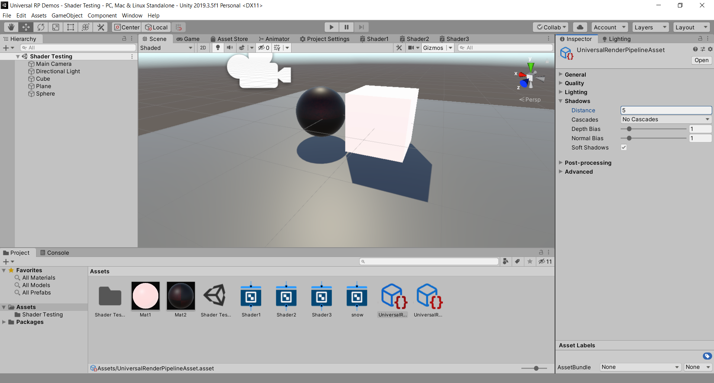

# Week 10 (3/24 & 3/26)

## Social Distancing Simulator

[Link to Social Distancing Simulator lesson](https://github.com/prismspecs/Virtual-Environments/tree/master/Unity%20Demos/Assets/Social%20Distancing%20Simulator/readme.md)

## Shaders *unfinished right now!*

**Important Note:** Make sure that when you create a new project you select Universal RP as the project type. This enables the new Universal Render Pipeline which includes ShaderGraph shaders, the node-based scripting language within Unity for creating Shaders. Universal RP or URP is a "light weight" rendering pipeline that has lots of bells and whistles. Its counterpart, HDRP or High Definition Render Pipeline, is for high-end graphics with requisite hardware. URP will come to be the standard project type in the future.

A shader is a small program containing instructions for the GPU. They describe how to calculate the onscreen color of a particular material.

Though Unity provides a Standard Shader, sometimes you may need to make an effect beyond what the out-of-the-box shader can do.

Historically, this has required a special shading language, such as Cg or HLSL, with conventions a bit different than typical gameplay scripting. For many, shader writing is a neglected area of game development, simply because of the extra learning curve involved.

Unity introduced Shader Graph to allow you to more easlily write shaders, with minimal to no coding. Best of all, Shader Graph makes it easy to get started with a visual, interactive interface.

### Shader Graph types

A PBR Graph (Physically Based Rendering) can be thought of as a core shader. That is, it can do must typical shader things, as opposed to more specialized Visual FX (like holographic projections, etc) or Sub Graphs (more below).

A Sub Graph is a special type of Shader Graph, which you can reference from inside other graphs. This is useful when you wish to perform the same operations multiple times in one graph or across multiple graphs.

A

### Getting Started

+ When you create a URP Project, it loads in a default scene to show off the new Render Pipeline Features. Feel free to pause here and check that out, but for our purposes we want to delete everything unnecessary. Before we do, I want you to notice that in Edit -> Project Settings -> Graphics, there is a Scriptable Render Pipeline Settings property that has a UniversalRP - High Quality asset already in place. Click that, and you will see the Project window highlight that file in Assets/Settings/

+ I bring this up because when we delete everything, we will also be deleting that Universal RP asset and will have to replace it, otherwise ShaderGraph will tell us that it is incompatible with the current Render Pipeline.

+ Go ahead and delete everything inside of the Assets folder.

+ Now you will need to create a new Universal Render Pipeline Asset to replace the one we deleted. Right click in the Project view and Create -> Rendering -> Universal Render Pipeline -> Pipeline Asset (Forward Renderer). This will create two new files, the URP Render Asset and the URP Forward Renderer. In a nutshell, the Render Asset is what will tell Unity that we want to use the new URP system and point to the Forward Renderer, and the Forward Renderer is the way each triangle in our game will be rendered--a Forward Renderer being the most basic implementation of just drawing each triangle one at a time (feel free to look into that more on your own).

+ Back in Edit -> Project Settings -> Graphics, you can now drop your newly created URP Render Asset onto the Scriptable Render Pipeline Settings area. This enables the new URP Rendering system, so we may now continue to work on ShaderGraph.

+ A material and a shader always work together to render a 3d mesh on-screen. So, before you can build your shader, you'll need a material as well

+ So the first step is to create a material, then create a shader and drop it onto that material. You can then drop that material onto a game object in the scene

+ So create a cube and drop the material onto it!

## Caveats

### Bad Shadows

If you have pixelated shadows, try adjusting your Universal Render Pipeline Asset settings as follows

[Official documentation for Shadow Cascades](https://docs.unity3d.com/Manual/shadow-cascades.html)

## Acknowledgements

Some helpful resources I used in researching this:
+ https://www.raywenderlich.com/3744978-shader-graph-in-unity-for-beginners

+ [Unity Shader Graph Tutorial](https://www.youtube.com/watch?v=UxmIC92BqfA)
